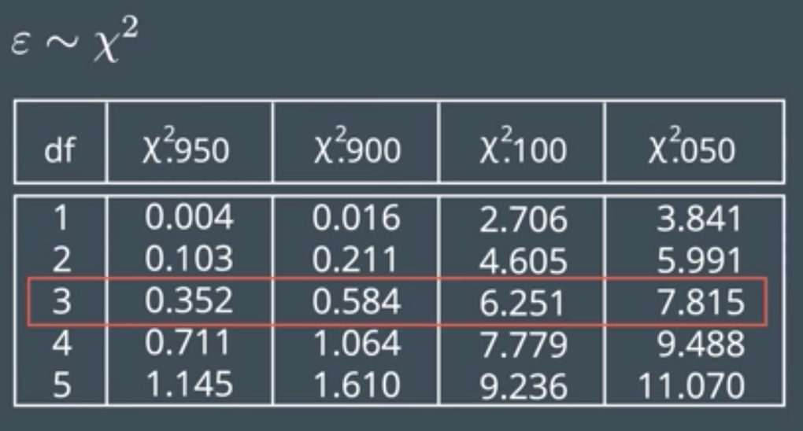
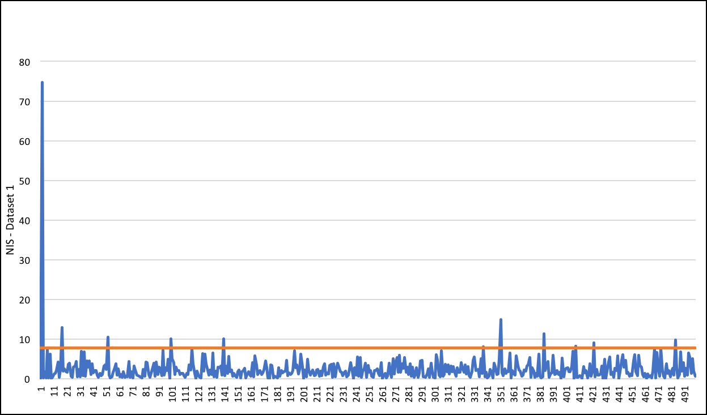

# Unscented Kalman Filter 

## Intro

This project consists in the implementation of an Unscented Kalman filter in C++. Unscented Kalman Filter (UKF) is a nonlinear version of the Kalman Filter, using a deterministic sampling technique to pich a minimla set of sample points (called sigma points) around the mean. These sigma points are then propagated through the non-linear functions, from which a new mean and covariance estimate are then formed. The result is a filter which more accurately estimates the true mean and covariance.

The process is as follows. We generate sigma points based on the state vector, covariance matrix and the process noise. Later to that, we will predict the sigma points using the  Δt. With the predicted sigma points we can calculate the prediction mean and covariance. Once we got all this, we go to the update step, where we transform the sigma predicted sigma points to measurement space and predict the measurement mean and covariance. In the last step we update the state mean and the covariance matrix. The flow can be seen in this diagram:

## Results

To check the good behaviour of the kalman filter we calculate the RMSE for the two different datasets.

To check the consistancy of the solution we will also calculate the Normalized Innovation Squared (NIS)

The correct value for NIS is coming from this table. Where we can see that with 3 degrees of freedom, we expect to have 5% of the values over 7.815.

To be sure that our filter does work correctly we have plot the NIS value and set a line (at 7.815) to indicate the 95%. We should observe that just aproximately 5% of the NIS values are over the line.

In the 4 graphs, we can observe that the NIS values just passes the 95% a few times. And most of the times is where there is a radar measurement.  

## Requirements

This project involves the Term 2 Simulator which can be downloaded [here](https://github.com/udacity/self-driving-car-sim/releases)

This repository includes two files that can be used to set up and install [uWebSocketIO](https://github.com/uWebSockets/uWebSockets) for either Linux or Mac systems. For windows you can use either Docker, VMware, or even [Windows 10 Bash on Ubuntu](https://www.howtogeek.com/249966/how-to-install-and-use-the-linux-bash-shell-on-windows-10/) to install uWebSocketIO. 

## How to run the code

Once requirements are fullfield, you can run the code following the next steps:

1. mkdir build
2. cd build
3. cmake ..
4. make
5. ./UnscentedKF

## Other Important Dependencies

* cmake >= 3.5
  * All OSes: [click here for installation instructions](https://cmake.org/install/)
* make >= 4.1
  * Linux: make is installed by default on most Linux distros
  * Mac: [install Xcode command line tools to get make](https://developer.apple.com/xcode/features/)
  * Windows: [Click here for installation instructions](http://gnuwin32.sourceforge.net/packages/make.htm)
* gcc/g++ >= 5.4
  * Linux: gcc / g++ is installed by default on most Linux distros
  * Mac: same deal as make - [install Xcode command line tools](https://developer.apple.com/xcode/features/)
  * Windows: recommend using [MinGW](http://www.mingw.org/)

## Basic Build Instructions

1. Clone this repo.
2. Make a build directory: `mkdir build && cd build`
3. Compile: `cmake .. && make` 
   * On windows, you may need to run: `cmake .. -G "Unix Makefiles" && make`
4. Run it: `./UnscentedKF `

## Code Style

This code is intented to follow the  [Google's C++ style guide](https://google.github.io/styleguide/cppguide.html).

